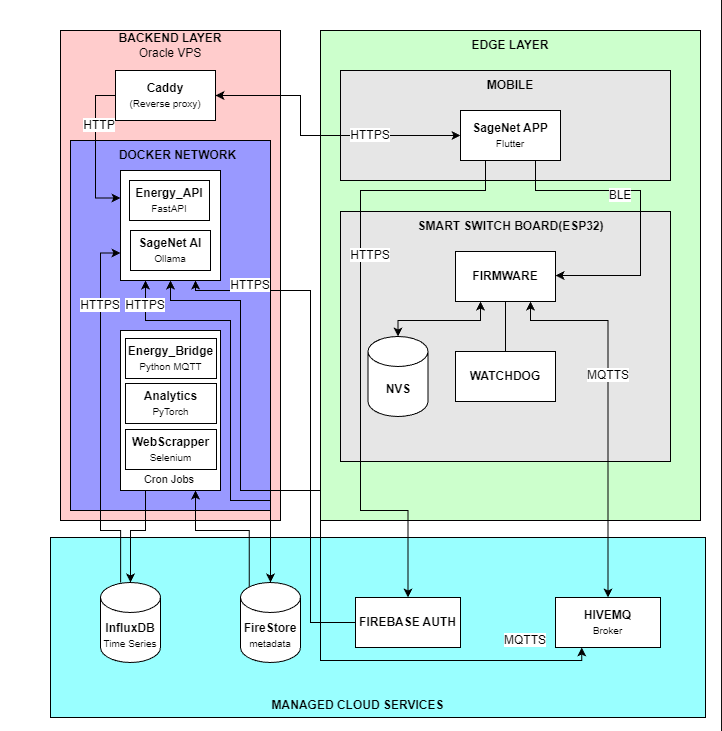

 
 <h1>SageNet Backend Infrastructure</h1>
 
<strong>Enterprise-Grade IoT Smart Grid & Energy Intelligence Platform</strong>

 

## 📖 Overview
SageNet is an advanced IoT backend designed to manage, analyze, and optimize residential power consumption. Built to handle high-frequency telemetry from custom ESP32 mesh networks, the backend is a decoupled, event-driven system leveraging Machine Learning for anomaly detection, predictive billing, and intelligent appliance recommendations.

Engineered with strict resource constraints in mind (optimized for Oracle Cloud Free Tier), the architecture employs lazy-loading ML models, distributed task queues, and asynchronous workers.

## 🏗️ System Architecture

 

The backend relies on a Decoupled Microservices Architecture communicating over localhost (Host Network Mode) to bypass strict cloud DNS limitations and maximize IPC performance.

### 🔌 The Data Flow
1. Edge Node: ESP32 sensors calculate raw RMS wattage and publish JSON to HiveMQ via MQTT.
2. Ingestion (Bridge): The Python MQTT Bridge consumes telemetry, resolves device ownership via Firestore, and stores time-series data in InfluxDB.
3. Real-Time Sync: Device states are instantly written to Firestore, allowing the Flutter App to react in <500ms via WebSockets.
4. Intelligence (Analytics): Background cron-jobs run anomaly detection and bill forecasting.
5. App Interface (API): FastAPI serves as the secure gatekeeper, handling JWT verification, hardware command routing, and historical data aggregation.

---

## ✨ Core Features

* Zero-Trust Security: Firebase JWT Bearer authentication on all endpoints. Ownership validation is enforced at the database query layer.
* Physics-Aware Anomaly Detection: Utilizes an On-Device PyTorch Transformer model to learn specific appliance patterns, clamped by statistical Z-Scores and physical wattage caps to prevent false positives during Inrush Currents.
* Predictive Billing Engine: Employs an XGBoost Regressor to analyze the last 60 days of dynamic daily kWh usage and forecast month-end bills based on complex telescopic utility tariffs (e.g., KSEB).
* Supervised RAG Shopping Agent: A distributed worker uses Selenium for live e-commerce scraping. Products are evaluated by a Dual-LLM Pipeline (Generator + Constitutional AI Supervisor) to recommend energy-efficient alternatives while preventing LLM hallucinations.
* Mesh Network Management: Fully supports ESP-NOW Parent-Child hardware relationships. Handles Orphan Discovery, Satellite Adoption, and Secure Unlinking entirely through the cloud.

---

## 🛠️ Technology Stack

| Category | Technology | Purpose |
| :--- | :--- | :--- |
| Core Framework | FastAPI, Python 3.11 | High-performance async REST API. |
| Time-Series DB | InfluxDB (Flux) | High-throughput sensor data ingestion & window aggregation. |
| NoSQL DB / Auth| Firebase Firestore / Auth | State persistence, User Profiles, JWT Auth. |
| Message Broker | Paho-MQTT & HiveMQ | IoT telemetry and command pub/sub. |
| Task Queue | Redis | Distributed queue for asynchronous scraping jobs. |
| Machine Learning | PyTorch, XGBoost | Anomaly inference and time-series forecasting. |
| Generative AI | Ollama, Selenium | Web scraping and local quantized LLM inference. |
| Infrastructure | Docker Compose | Containerized microservices (Host Network Mode). |

---

## 📂 Microservice Breakdown

The system is split into 4 distinct containerized services defined in docker-compose.yml:

1. energy_api: The Commander. Exposes REST endpoints, validates tokens, and publishes commands back to the MQTT broker.
2. energy_bridge: The Ingestor. A 24/7 daemon that subscribes to evt/+/telem and evt/+/proxy, unboxing mesh network data and routing it to databases.
3. energy_analytics: The Brain. A scheduled worker that trains Deep Learning models dynamically, detects Vampire Loads, and triggers FCM Push Notifications for anomalies.
4. energy_scraper_worker: The Shopper. Pops RAG tasks from Redis, controls a headless Chromium container, and interfaces with the LLM Supervisor.

---

## 🚀 Setup & Deployment

### Prerequisites
* Docker & Docker Compose
* HiveMQ Cluster Credentials
* InfluxDB Cloud/Local Token
* Firebase Admin SDK JSON (serviceAccountKey.json)

### 1. Environment Configuration
Create a .env file in the root directory:
env # MQTT CONFIG MQTT_BROKER=your-cluster.hivemq.cloud MQTT_PORT=8883 MQTT_USER=backend_service MQTT_PASS=your_secure_password  # INFLUXDB CONFIG INFLUX_URL=https://eu-central-1-1.aws.cloud2.influxdata.com INFLUX_ORG=your_org INFLUX_BUCKET=energy_raw INFLUX_TOKEN=your_token  # REDIS CONFIG REDIS_HOST=127.0.0.1 REDIS_PORT=6379 REDIS_PASS=YourRedisPassword 

### 2. Launch Services
The project utilizes targeted Dockerfiles to optimize build caching (separating heavy ML dependencies from lightweight API dependencies).

bash # Build and run all services in detached mode docker compose up -d --build 

### 3. Verify Deployment
* API Documentation: Navigate to http://<server-ip>:8000/docs to view the interactive Swagger UI.
* Logs: Monitor the AI engine in real-time:
 bash  docker logs -f energy_analytics 

---

## 🧠 Advanced Machine Learning Notes

### Supervision-Based AI Alignment (Constitutional AI)
To ensure the Shopping Assistant never recommends unsafe electrical appliances or hallucinates prices, the system implements a Multi-Agent Supervisor Architecture:
1. Generator LLM (4-bit Quantized) processes scraped data and generates a recommendation.
2. Supervisor LLM acts as an independent Red-Team filter. It evaluates the output against strict constraints (e.g., verifying BEE Star ratings and basic electrical laws). If the response violates safety policies, it is blocked.

### Lazy Loading Model Architecture
To operate within strict RAM constraints, the PyTorch Anomaly Transformer uses a "Lazy Load & Dump" strategy. Models (.pth state dicts) are loaded from the disk into CPU memory exclusively during the millisecond of inference, and gc.collect() is explicitly called post-inference to prevent memory leaks.
